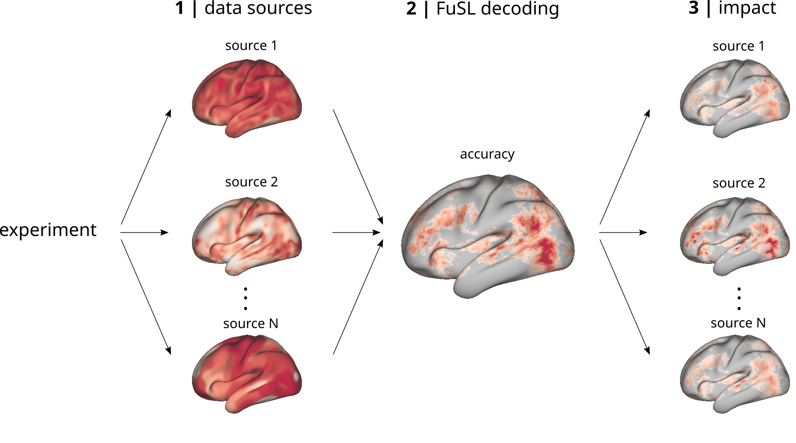

# Fusion searchlight



Fusion searchlight (FuSL) is a framework that allows to integrate multiple types of data in a searchlight decoding analysis. 

1. Different data sources, related to different metrics or neuroimaging modalties, are combined in a searchight analysis to decode a brain state.

2. Searchlight decoding yields a spatial map of local decoding accuracies that highlight informative brain regions. 

3. In a next step explainable AI ([SHAP](https://github.com/shap/shap)) is used to reconstruct the differential impact of each source on the decoding. 

The framework is based on our recent paper:

> Wein, S., Riebl, M., Brunner, L., Nothdurfter, C., Rupprecht, R., Schwarzbach, J.: [Data Integration with Fusion Searchlight: Classifying Brain States from Resting-state fMRI](https://doi.org/10.1016/j.neuroimage.2025.121263) (2024).

---

## Demos 

A demo version is provided, which can be directly run in Google Colab:

> https://colab.research.google.com/github/simonvino/FuSL/blob/main/FuSL_demo_colab_surf.ipynb

This demo version uses an artificial dataset, which can serve as a template for your own data. This jupyter notebook is based on surface files in **cifti** format, and an alternative version using volumetric files in **nifti** format is provided in:

> https://colab.research.google.com/github/simonvino/FuSL/blob/main/FuSL_demo_colab_vol.ipynb

Both demo versions contain a step-by-step manual, how your data can be structured to enter the FuSL workflow. 

Demo jupyter notebooks you can run **locally** after installing the requirements are provided:


> [FuSL_demo_surf.ipynb](FuSL_demo_surf.ipynb)

> [FuSL_demo_vol.ipynb](FuSL_demo_vol.ipynb)


## Requirements

- numpy
- scikit-learn
- nilearn
- shap
- hcp-utils
- mne

Also a conda [FuSL.yml](FuSL.yml) file is provided. The environment can be installed with:

```
conda env create -f FuSL.yml
```


To run FuSL you can either name your files in analogy to the example files in the `data` folder, or you can directly format your data arrays in python as described in the demos in more detail. The MRI preprocessing pipline [fMRIPrep](https://fmriprep.org/en/stable/) provides one possibility to generate surface files in the **cifti** format.

---

## Citation

If you find our framework useful, please reference our paper:

> Wein, S., Riebl, M., Brunner, L., Nothdurfter, C., Rupprecht, R., Schwarzbach, J.: [Data Integration with Fusion Searchlight: Classifying Brain States from Resting-state fMRI](https://doi.org/10.1016/j.neuroimage.2025.121263). NeuroImage, 315 (2025).

Or with BibTeX:

```
@article{Wein2025,
title = {Data integration with Fusion Searchlight: Classifying brain states from resting-state fMRI},
journal = {NeuroImage},
volume = {315},
pages = {121263},
year = {2025},
issn = {1053-8119},
doi = {https://doi.org/10.1016/j.neuroimage.2025.121263},
author = {Simon Wein and Marco Riebel and Lisa-Marie Brunner and Caroline Nothdurfter and Rainer Rupprecht and Jens V. Schwarzbach},
}
```

